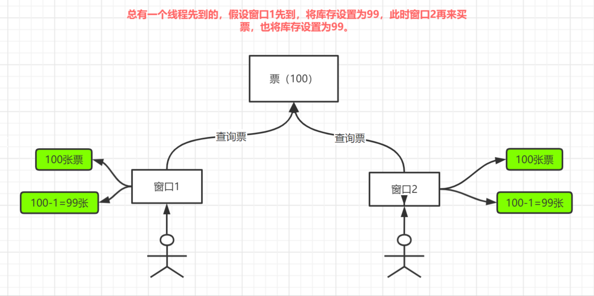
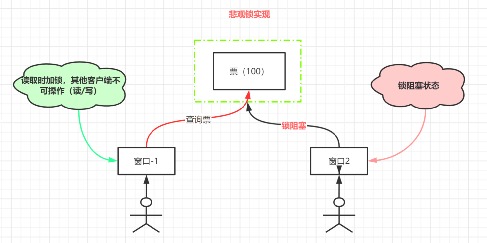
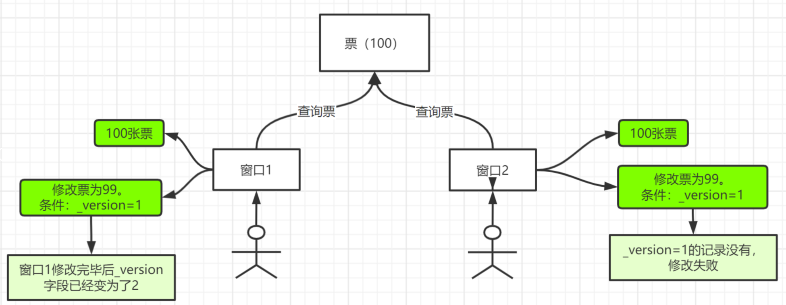

# 参考文章

[MybatisPlus详细讲解（适合新手和复习）](https://blog.csdn.net/qq_62325622/article/details/134562480)

[SpringBoot3 + MyBatisPlus 快速整合](https://blog.csdn.net/qq_34709175/article/details/142982502)

[超详细超全面的MyBatisPlus的所有使用方法](https://blog.csdn.net/Bb15070047748/article/details/129212543)


# 测试样例

/src/test/java/com/example/mybatispluslearning/test/MybatisPlusApplicationTests


# maven依赖

```xml
<!--   mybatis-plus 相关依赖   -->
        <dependency>
            <groupId>com.baomidou</groupId>
            <artifactId>mybatis-plus-spring-boot3-starter</artifactId>
            <version>3.5.7</version>
        </dependency>
        <!-- 代码生成器 -->
        <dependency>
            <groupId>com.baomidou</groupId>
            <artifactId>mybatis-plus-generator</artifactId>
            <version>3.5.7</version>
        </dependency>
        <!--  mysql 依赖 版本由继承的 spring-boot-starter-parent 控制，也可以自己指定  -->
        <dependency>
            <groupId>com.mysql</groupId>
            <artifactId>mysql-connector-j</artifactId>
        </dependency>

        <!-- 模板引擎 -->
        <dependency>
            <groupId>org.freemarker</groupId>
            <artifactId>freemarker</artifactId>
        </dependency>

        <!--lombok-->
        <dependency>
            <groupId>org.projectlombok</groupId>
            <artifactId>lombok</artifactId>
        </dependency>
```

## 配置数据库连接

```yml
spring:
  datasource:
    driver-class-name: com.mysql.cj.jdbc.Driver
    url: jdbc:mysql://localhost:3306/votedb?autoReconnect=true&useUnicode=true&characterEncoding=utf8&useSSL=false&rewriteBatchedStatements=true
    username: root
    password: 8888.216
```

## 要进行mapper的扫描在启动类上加注解

```java
@MapperScan("com.example.mybatispluslearning.mapper")
```

```java
package com.example.mybatispluslearning;

import org.mybatis.spring.annotation.MapperScan;
import org.springframework.boot.SpringApplication;
import org.springframework.boot.autoconfigure.SpringBootApplication;

@MapperScan("com.example.mybatispluslearning.mapper")
@SpringBootApplication
public class MybatisPlusLearningApplication {

    public static void main(String[] args) {
        SpringApplication.run(MybatisPlusLearningApplication.class, args);
    }

}

```

## 数据库

创建数据库votedb,然后创建下表

```sql
create table user
(
    id          bigint auto_increment comment '主键'
        primary key,
    user_name   varchar(255)  null comment '用户名',
    password    varchar(255)  null comment '密码',
    phone       varchar(255)  null comment '手机',
    email       varchar(255)  null comment '邮箱',
    age         int           null comment '年龄',
    role        varchar(2)    null comment '角色',
    create_time datetime      null comment '创建时间',
    update_time datetime      null comment '修改时间',
    version     int default 1 null comment '乐观锁',
    deleted     int default 1 null comment '逻辑删除'
)
    charset = utf8mb3;
 
create table vote_theme
(
    id                bigint           not null comment '主题主键'
        primary key,
    theme_name        varchar(255)     null comment '主题名',
    theme_explain     text             null comment '相关说明',
    expectation_sum   bigint default 0 null comment '总期望值',
    expectation_times bigint default 0 null comment '期望人次',
    imgurl            varchar(2550)    null comment '主题图片',
    end_date          datetime         null,
    start_date        datetime         null,
    gmt_create        datetime         null comment '创建时间',
    gmt_modified      datetime         null comment '修改时间'
)
    charset = utf8mb3;
 

```

```sql
INSERT INTO votedb.user (id, user_name, password, phone, email, age, role, create_time, update_time, version, deleted) VALUES (1358687078200619010, 'wzp', '674f6e6d9b25a084110e992042ad0cdb', '17753657132', '1231@163.com', 22, 'a', '2022-11-22 20:53:35', '2023-11-22 20:53:35', 1, 0);
INSERT INTO votedb.user (id, user_name, password, phone, email, age, role, create_time, update_time, version, deleted) VALUES (1358687341250588673, 'admin', '674f6e6d9b25a084110e992042ad0cdb', '17753657132', '124@163.com', 28, 'a', '2022-11-22 20:53:40', '2023-11-22 20:53:40', 1, 0);
INSERT INTO votedb.user (id, user_name, password, phone, email, age, role, create_time, update_time, version, deleted) VALUES (1358687744079933441, 'wahahaa', '674f6e6d9b25a084110e992042ad0cdb', '18553777133', '123@126.com', 38, 'u', '2022-07-22 20:53:35', '2023-07-22 20:53:35', 1, 0);
INSERT INTO votedb.user (id, user_name, password, phone, email, age, role, create_time, update_time, version, deleted) VALUES (1358693663190769666, 'hanjia', '674f6e6d9b25a084110e992042ad0cdb', '18577657134', '129@163.com', 18, 'u', '2022-05-22 20:53:35', '2023-05-22 20:53:35', 1, 0);
INSERT INTO votedb.user (id, user_name, password, phone, email, age, role, create_time, update_time, version, deleted) VALUES (1362299967155175426, 'wanghia', '123', '123132', '2222', 18, 'u', '2022-02-22 20:53:35', '2023-02-22 20:53:35', 1, 0);
INSERT INTO votedb.user (id, user_name, password, phone, email, age, role, create_time, update_time, version, deleted) VALUES (1362959351606640641, 'zhangsan', '674f6e6d9b25a084110e992042ad0cdb', '18453657775', '2222@qq.com', 40, 'a', '2022-08-22 20:53:35', '2023-08-22 20:53:35', 1, 0);
INSERT INTO votedb.user (id, user_name, password, phone, email, age, role, create_time, update_time, version, deleted) VALUES (1380808280388952066, '123123123', '674f6e6d9b25a084110e992042ad0cdb', '18553657776', '24423@qq.com', 18, 'u', '2022-01-22 20:53:35', '2023-01-22 20:53:35', 1, 0);

```


## 具体的sql语句

如果你想要查看到具体的sql语句的话你可以使用yml配置开启日志

yml配置文件配置日志

```yml
#配置日志
mybatis-plus:
  configuration:
    log-impl: org.apache.ibatis.logging.stdout.StdOutImpl
```

## 主键策略

```java
/**
     * 主键
     */
    @TableId(value = "id", type = IdType.AUTO)
    private Long id;
```


### 1.AUTO(0):

- 策略：自动增长。这意味着主键的值会自动递增，通常适用于整数型的主键。
- 使用场景：当数据库中的主键设置为自增长时，可以使用此策略。


### 2.NONE(1):

- 策略：没有主键。这表示实体类没有主键值，或者说不使用主键。
- 使用场景：在某些情况下，可能不需要主键，或者在其他字段中定义复合主键时可以使用。


### 3.INPUT(2):

- 策略：手动输入。这意味着在插入数据时需要手动指定主键的值。
- 使用场景：适用于非自增、非UUID的主键类型，例如字符串或其他数据类型的主键。


### 4.ASSIGN_ID(3):

- 策略：分配ID。这通常是由程序分配的一个长整型ID。
- 使用场景：当需要使用程序中自定义的ID生成策略时，可以使用此选项。


### 5.ASSIGN_UUID(4):

- 策略：分配UUID。这意味着主键的值将是一个生成的UUID。
- 使用场景：当主键需要是UUID类型时，可以使用此策略。UUID可以确保全局唯一性，适用于分布式系统等场景。

## 自动填充

我们现在设置user字段多添加两个字段一个是创建时间、一个是修改时间

对应在实体类User.java中也要加入字段

```java
    /**
     * 创建时间
     */
    @TableField(fill = FieldFill.INSERT)   //使用的是插入策略
    private Date createTime;
 
    /**
     * 修改时间
     */
    @TableField(fill = FieldFill.UPDATE)
    private Date updateTime;
```

MetaObjectHandler我们需要自定义一个Handler实现此接口从而实现操作填充策略

```java
@Slf4j
@Component
public class MyMetaObjectHandler implements MetaObjectHandler {
    //插入时候的策略
    @Override
    public void insertFill(MetaObject metaObject) {
        log.info("start insert fill ....");
        this.setFieldValByName("createTime",new Date(),metaObject);
    }
    //修改时候的策略
    @Override
    public void updateFill(MetaObject metaObject) {
        log.info("start update fill ....");
        this.setFieldValByName("updateTime",new Date(),metaObject);
    }
}

```


## 乐观锁和悲观锁

### 什么是乐观锁

乐观锁的操作理念是“乐观”，它假设并发操作中数据冲突的可能性较小，因此在进行数据操作时不会直接锁定数据。只是在执行更新操作时，会判断在此期间是否有其他操作修改了数据。如果有其他操作修改了数据，那么乐观锁会放弃操作，否则执行操作。

### 什么是悲观锁
悲观锁的操作理念则相对“悲观”，它假设并发操作中数据冲突的可能性较大，因此在进行数据操作时会直接锁定数据，直到操作完成后才会释放锁。在锁定期间，其他操作不能修改数据，只能等待锁被释放。

### 配置乐观锁

本文主要讲解乐观锁机制

乐观锁实现方式：

1. 取出记录时，获取当前version
2. 更新时，带上这个version
3. 执行更新时，set version = newVersion where version = oldVersion
4. 如果version不对，就更新失败

第一步：在数据库中user表添加一个version字段

第二步：在实体类中添加version并且在version字段上加@Version注解

```java
@Version //乐观锁注解
    private int version;
```

第三步：编写mybatis-plus的配置类

```java
package com.ltx.mybatis_plus.config;
 
import com.baomidou.mybatisplus.extension.plugins.MybatisPlusInterceptor;
import com.baomidou.mybatisplus.extension.plugins.inner.OptimisticLockerInnerInterceptor;
import org.mybatis.spring.annotation.MapperScan;
import org.springframework.context.annotation.Bean;
import org.springframework.context.annotation.Configuration;
 
@Configuration
@MapperScan("com.ltx.mybatis_plus.mapper")
public class MybatisPlusConfig {
    /**
     * 新版
     */
    @Bean
    public MybatisPlusInterceptor mybatisPlusInterceptor() {
        MybatisPlusInterceptor mybatisPlusInterceptor = new MybatisPlusInterceptor();
        mybatisPlusInterceptor.addInnerInterceptor(new OptimisticLockerInnerInterceptor());
        return mybatisPlusInterceptor;
    }
}

```

测试:

```java
 /**
     * 乐观锁测试
     * 乐观锁的操作理念是“乐观”，它假设并发操作中数据冲突的可能性较小，因此在进行数据操作时不会直接锁定数据。
     * 只是在执行更新操作时，会判断在此期间是否有其他操作修改了数据。
     * 如果有其他操作修改了数据，那么乐观锁会放弃操作，否则执行操作。
     */
    @Test
    void test02() {
        User user1 = userMapper.selectById(1380808280388952068L);
        user1.setUserName("tangfire1");
        user1.setAge(19);

        User user2 = userMapper.selectById(1380808280388952068L);
        user2.setAge(20);
        user2.setUserName("tangfire2");
        userMapper.updateById(user2);//当前插队操作会改变version的值本来version为1的，但是经过此次操作后version就会变成2

        userMapper.updateById(user1);//当前id中的version为2了，但是user1中保存的version还是1，所以这个地方就会操作失败
    }

```

## 分页查询

首先要使用分页查询就要先去配置分页查询的插件，所以我们需要在mybatisplus的配置类中先注册

```java
/**
     * 添加分页插件
     */
    @Bean
    public MybatisPlusInterceptor mybatisPlusInterceptor() {
        MybatisPlusInterceptor interceptor = new MybatisPlusInterceptor();
        interceptor.addInnerInterceptor(new PaginationInnerInterceptor(DbType.MYSQL));//如果配置多个插件,切记分页最后添加
        //interceptor.addInnerInterceptor(new PaginationInnerInterceptor()); 如果有多数据源可以不配具体类型 否则都建议配上具体的DbType
        return interceptor;
    }

```

```java
    <P extends IPage<T>> P selectPage(P page, @Param("ew") Wrapper<T> queryWrapper);
```

首先我们需要从BaseMapper里面找到关于分页查询的方法，在此方法中我们看见了一个关于P继承了IPage的操作，我们需要查看这个IPage里面封装的是一些什么数据

```java
当前页：+ page.getCurrent()
总页数：+ page.getPages()
记录数：+ page.getTotal()
是否有上一页： page.hasPrevious()
是否有下一页： page.hasNext()
```

对于第二个参数Wrapper<T> queryWrapper可以直接写null

```java
/**
     *分页查询
     */
    @Test
    void selectByPageTest() {
        // 两个参数：current的值默认是1，从1开始，不是0,指的是当前的页。size是每一页的条数。
        Page<User> page = new Page<>(2,3);
        Page<User> userPage = userMapper.selectPage(page, null);
        System.out.println("Records = "+userPage.getRecords());
        System.out.println("Pages = "+userPage.getPages());
        //page的其他方法
        System.out.println("当前页：" + page.getCurrent());
        System.out.println("总页数：" + page.getPages());
        System.out.println("记录数：" + page.getTotal());
        System.out.println("是否有上一页：" + page.hasPrevious());
        System.out.println("是否有下一页：" + page.hasNext());
    }
```

通过查看结果我们可以知道其实就是调用了一个分页查询，只是在内部封装帮你计算好是从那一个元素开始


## 逻辑删除

```java
物理删除：从数据库中直接删除

逻辑删除：在数据库中没有被删除，而是通过一个变量来让它失效。 deleted=0 --->deleted=1
```

1、在数据表中增加一个deleted字段

2、同步实体类，在实体类上加上@TableLogic 注解

```java
@TableLogic //逻辑删除
private Integer deleted;
```

3、配置application.yml文件

```yml
mybatis-plus:
  global-config:
    db-config:
      logic-delete-field: deleted # 全局逻辑删除的实体字段名(配置后可以忽略不配置 @TableLogic)
      logic-delete-value: 1 # 逻辑已删除值(默认为 1)
      logic-not-delete-value: 0 # 逻辑未删除值(默认为 0)
```

4、测试

```java
 /**
     * 逻辑删除
     * 查看日志输出可以看到，delete的语句变成了update语句，实质上就是update（修改）语句，将deleted字段从0修改为1以yml的配置作为参照
     */
    @Test
    void logicDeleteTest03() {
        userMapper.deleteById(1380808280388952066L);
    }
```

查看日志输出可以看到，delete的语句变成了update语句，实质上就是update（修改）语句，将deleted字段从0修改为1以yml的配置作为参照

5、对刚刚逻辑删除的id字段用户进行查询

```java
    @Test
    void selectTest01() {
        User user = userMapper.selectById(1380808280388952066L);
        System.out.println(user);
    }
```

查看日志输出可以看到，seletc的语句以经发生了更改

增加了deleted的判断语句，判断deleted是否为0，为0则能搜索，1则不能。

## 执行sql分析打印

`p6spy依赖引入`

p6spy 组件的引入可以完美的输出打印 SQL 及执行时长用来解决新版的日志输出没有执行时间和完整的sql语句。

### maven配置

```xml
<!-- https://mvnrepository.com/artifact/p6spy/p6spy -->
        <dependency>
            <groupId>p6spy</groupId>
            <artifactId>p6spy</artifactId>
            <version>3.9.1</version>
        </dependency>
```

### 配置

```yml
#mysql配置
spring:
  datasource:
    password: 8888.216
    username: root
    driver-class-name: com.p6spy.engine.spy.P6SpyDriver
    url: jdbc:p6spy:mysql:///votedb?userUnicode=true&characterEncoding=utf-8&serverTimezone=Asia/Shanghai
```

### spy.properties 配置

```properties
#3.2.1以上使用
modulelist=com.baomidou.mybatisplus.extension.p6spy.MybatisPlusLogFactory,com.p6spy.engine.outage.P6OutageFactory
#3.2.1以下使用或者不配置
#modulelist=com.p6spy.engine.logging.P6LogFactory,com.p6spy.engine.outage.P6OutageFactory
# 自定义日志打印
logMessageFormat=com.baomidou.mybatisplus.extension.p6spy.P6SpyLogger
#日志输出到控制台
appender=com.baomidou.mybatisplus.extension.p6spy.StdoutLogger
# 使用日志系统记录 sql
#appender=com.p6spy.engine.spy.appender.Slf4JLogger
# 设置 p6spy driver 代理
deregisterdrivers=true
# 取消JDBC URL前缀
useprefix=true
# 配置记录 Log 例外,可去掉的结果集有error,info,batch,debug,statement,commit,rollback,result,resultset.
excludecategories=info,debug,result,commit,resultset
# 日期格式
dateformat=yyyy-MM-dd HH:mm:ss
# 实际驱动可多个
#driverlist=org.h2.Driver
# 是否开启慢SQL记录
outagedetection=true
# 慢SQL记录标准 2 秒
outagedetectioninterval=2

```


## 在Mybatis-plus中是使用xml文件

实际上在Mybatis-plus中使用xml文件也和在mybatis中使用xml文件一样的

```yml
mybatis-plus:
  # 配置mapper的扫描，找到所有的mapper.xml映射文件 如果和默认路径一样可以不配置
  mapper-locations: classpath*:/mapper/**/*.xml
```

在 MyBatis-Plus 配置文件中的 `mapper-locations: classpath*:/mapper/**/*.xml` 配置项指定了 MyBatis 映射文件（Mapper XML 文件）的位置。

### 解释：
- **`mapper-locations`**：这个配置项用于指定 MyBatis 映射文件的路径，映射文件通常是用于存放 SQL 映射的 XML 文件，通常与 MyBatis 的 `Mapper` 接口进行映射。
- **`classpath*:/mapper/**/*.xml`**：这个路径是一个类路径匹配模式，表示：
    - `classpath*:`：从类路径中加载资源。`classpath*:` 会匹配所有类路径下的 `mapper` 文件夹（包括 JAR 包中的资源）。
    - `/mapper/`：指示在类路径中查找 `mapper` 文件夹（这个文件夹通常包含你的 Mapper XML 配置文件）。
    - `/**/*.xml`：表示递归匹配 `mapper` 文件夹下及其子文件夹中的所有 `.xml` 文件。

### 具体位置：
1. **`mapper` 文件夹**：你的项目中应该有一个名为 `mapper` 的文件夹，存放所有的 MyBatis 映射文件（`*.xml` 文件）。这个文件夹的位置应该是项目的 **资源文件夹** 下的一个目录（通常是 `src/main/resources`）。
    - 例如：`src/main/resources/mapper`，这个路径下存放所有的 Mapper XML 文件。

2. **类路径匹配**：配置中使用的 `classpath*:` 表示无论这些 XML 文件是直接在项目的资源文件夹中，还是在打包后的 JAR 包中，都可以找到并加载它们。

### 示例项目结构：
假设你的项目结构如下：
```
src
├── main
│   ├── java
│   ├── resources
│   │   ├── mapper
│   │   │   ├── UserMapper.xml
│   │   │   ├── ProductMapper.xml
```

在这种情况下，`mapper-locations: classpath*:/mapper/**/*.xml` 会加载 `src/main/resources/mapper` 目录下的所有 XML 文件。

### 总结：
`mapper-locations: classpath*:/mapper/**/*.xml` 说明：
- 在类路径下查找所有位于 `mapper` 目录及其子目录下的 XML 文件。
- 这些文件通常是 MyBatis 映射文件，包含 SQL 语句和映射规则。
- 通常它们会位于 `src/main/resources/mapper` 目录，或打包后的 JAR 文件中的 `mapper` 目录下。


------------------------

`classpath` 和 `classpath*` 都是用来指定类路径（ClassPath）资源的位置，但是它们之间有一个重要的区别，特别是在资源加载方面。

### 1. **`classpath:`**

- **定义**：`classpath:` 用于从类路径中加载单个资源文件或目录。
- **作用**：它仅从 **当前的类路径** 中查找指定的资源（通常指的是应用程序或 JAR 包中的类路径）。当你使用 `classpath:` 时，它只会匹配当前类路径下的资源，而不会递归地搜索 JAR 包中的资源。

  例如：
  ```yaml
  mapper-locations: classpath:/mapper/**/*.xml
  ```
  这表示只会在 **当前类路径下** 查找 `mapper` 文件夹及其子目录中的所有 `.xml` 文件。假设在 `src/main/resources/mapper` 文件夹下有一些 `.xml` 文件，它们会被加载。

- **使用场景**：适用于你知道资源文件或目录确切位置，并且只需要从本地文件系统或者当前的类路径中加载资源时。

### 2. **`classpath*:`**

- **定义**：`classpath*:` 是一个增强的路径匹配符，它会 **从类路径和所有 JAR 包中** 查找资源。
- **作用**：与 `classpath:` 的不同之处在于，`classpath*:` 会 **递归地** 查找所有 JAR 文件和类路径下的资源。如果资源在 JAR 包内部的某个路径中，也会被加载。

  例如：
  ```yaml
  mapper-locations: classpath*:/mapper/**/*.xml
  ```
  这表示会查找类路径中所有地方的 `mapper` 文件夹及其子目录中的 `.xml` 文件。不仅仅是应用程序的文件系统中的 `mapper` 目录，还会搜索所有依赖的 JAR 包中的 `mapper` 目录。

- **使用场景**：适用于当你的资源文件可能存在于多个 JAR 包中，或者你希望能够加载项目依赖中的资源时。通常在多模块或包含多个 JAR 包的项目中，`classpath*:` 非常有用。

### 主要区别：

| **特性**           | **`classpath:`**                               | **`classpath*:`**                                 |
|--------------------|-----------------------------------------------|-------------------------------------------------|
| **资源查找范围**   | 仅限于当前类路径（包括本地文件和 JAR 包中的类路径） | 当前类路径 + 所有 JAR 包中的类路径             |
| **递归搜索**       | 不会递归搜索 JAR 包中的资源                  | 会递归搜索所有 JAR 包中的资源                   |
| **应用场景**       | 当资源仅位于类路径中时使用                    | 当资源可能位于类路径或依赖的 JAR 包中时使用     |

### 示例：

假设你有以下项目结构：

```
/my-app
  /src
    /main
      /resources
        /mapper
          UserMapper.xml
  /lib
    /dependency.jar
      /mapper
        ProductMapper.xml
```

- **`classpath:/mapper/**/*.xml`**：只会加载 `src/main/resources/mapper/UserMapper.xml`。
- **`classpath*:/mapper/**/*.xml`**：会加载 `src/main/resources/mapper/UserMapper.xml` 以及 `lib/dependency.jar` 内的 `mapper/ProductMapper.xml`，因为它会搜索所有 JAR 包和类路径中的 `mapper` 目录。

### 总结：
- `classpath:` 只会从当前类路径加载资源。
- `classpath*:` 会从当前类路径和所有 JAR 包中递归加载资源。


-----------------------


首先我们需要创建mapper.xml文件与mapper文件进行绑定


### UserMapper01.xml

```xml
<?xml version="1.0" encoding="UTF-8"?>
<!DOCTYPE mapper PUBLIC "-//mybatis.org//DTD Mapper 3.0//EN" "http://mybatis.org/dtd/mybatis-3-mapper.dtd">
<mapper namespace="com.example.mybatispluslearning.mapper.UserMapper01">  <!--不同的mapper文件需要改的地方就是这里-->
    <select id="getUserName" parameterType="Long" resultType="String">
        select user_name from user where id = #{id}
    </select>

</mapper>
```

### 我们现在UserMapper01中创建函数

```java
package com.example.mybatispluslearning.mapper;

import com.baomidou.mybatisplus.core.mapper.BaseMapper;
import com.example.mybatispluslearning.entity.User;

public interface UserMapper01 extends BaseMapper<User> {
    String getUserName(Long id);
}

```

### 在测试类中测试编写的sql语句是否可用

```java
/**
     * 测试xml文件
     */
    @Test
    void xmlTest() {
        System.out.println(userMapper01.getUserName(1380808280388952068L));
    }
```

------------------------------------


# MybatisPlus的使用


## MyBatis-Plus 能够知道操作哪张表，通常是基于以下几个机制：

---

### 1. **实体类与表的映射**
MyBatis-Plus 是一个基于 MyBatis 的增强工具，使用实体类和数据库表之间的映射来确定目标表。

- **实体类与表的默认映射规则**：
  MyBatis-Plus 默认会将实体类名转化为数据库表名：
  - 实体类名 **驼峰命名** -> 表名 **下划线命名**。
  - 例如，`UserInfo` 实体类会映射到 `user_info` 表。

- **通过注解指定表名**：
  如果表名和默认映射规则不一致，可以使用 `@TableName` 注解指定表名：
  ```java
  @TableName("custom_table_name")
  public class UserInfo {
      private Long id;
      private String name;
  }
  ```

---

### 2. **Mapper 接口继承 BaseMapper**
在 MyBatis-Plus 中，Mapper 接口通常继承自 `BaseMapper<T>`，其中 `T` 是实体类类型。

- **BaseMapper** 自动绑定实体类的表名：
  - 通过 `T` 知道当前操作的实体类。
  - 根据实体类与表的映射关系，确定目标表。

示例代码：
```java
public interface UserMapper extends BaseMapper<UserInfo> {
    // UserInfo 实体类默认映射到 user_info 表
}
```

---

### 3. **全局配置的表名策略**
MyBatis-Plus 提供了全局配置选项，可以影响表名映射策略：

- **下划线命名规则**：
  默认启用驼峰转下划线规则，可以通过以下配置调整：
  ```java
  GlobalConfig globalConfig = new GlobalConfig();
  globalConfig.setDbConfig(new GlobalConfig.DbConfig()
      .setTableUnderline(true)); // 启用下划线命名
  ```

- **自定义表名策略**：
  如果需要完全自定义映射规则，可以实现自己的 `INameConvert` 接口：
  ```java
  public class CustomNameConvert implements INameConvert {
      @Override
      public String entityNameConvert(Class<?> entityClass) {
          return "prefix_" + entityClass.getSimpleName().toLowerCase();
      }
  }
  ```

---

### 4. **动态 SQL**
MyBatis-Plus 提供了动态 SQL 能力，可以在运行时指定表名。

示例：
```java
String tableName = "dynamic_table";
QueryWrapper<UserInfo> wrapper = new QueryWrapper<>();
wrapper.eq("status", 1);
List<UserInfo> list = baseMapper.selectList(wrapper);

// 动态 SQL 中指定表名
DynamicTableNameParser parser = new DynamicTableNameParser();
parser.setTableNameHandler((metaObject, sql, tableNameParam) -> tableName);
```

这段代码是一个动态表名的使用示例，以下是逐步解析和解释：

---

### 1. **动态表名的背景**
在某些情况下，数据库表名可能是动态变化的，比如分表场景（`user_2024`、`user_2023` 等）。MyBatis-Plus 提供了动态表名功能，可以在运行时决定具体操作的表。

---

### 2. **代码分解和解释**

#### **(1) 定义目标表名**
```java
String tableName = "dynamic_table";
```
- 定义一个动态表名为 `"dynamic_table"`。
- 这可以是从代码中计算出的表名，也可以从配置文件、上下文、参数中获取。

---

#### **(2) 构造查询条件**
```java
QueryWrapper<UserInfo> wrapper = new QueryWrapper<>();
wrapper.eq("status", 1);
```
- **`QueryWrapper<UserInfo>`**：
  - 是 MyBatis-Plus 提供的一个条件构造器，用于动态生成 SQL 查询条件。
  - 在这里，`wrapper.eq("status", 1)` 表示添加一个等值条件：`WHERE status = 1`。

---

#### **(3) 执行查询**
```java
List<UserInfo> list = baseMapper.selectList(wrapper);
```
- **`baseMapper.selectList(wrapper)`**：
  - `baseMapper` 是继承自 `BaseMapper<UserInfo>` 的 DAO 层接口。
  - 调用 `selectList(wrapper)` 会执行查询，返回符合条件的结果列表。

---

#### **(4) 动态表名处理器**
```java
DynamicTableNameParser parser = new DynamicTableNameParser();
parser.setTableNameHandler((metaObject, sql, tableNameParam) -> tableName);
```
- **`DynamicTableNameParser`**：
  - 是 MyBatis-Plus 提供的一个类，用于动态解析 SQL 中的表名。
  - 通过 **表名处理器** 来动态指定表名。

- **`setTableNameHandler`**：
  - 注册一个表名处理器，用于动态生成表名。
  - 处理器接收三个参数：
    1. **`metaObject`**：元数据对象，包含当前操作的一些上下文信息。
    2. **`sql`**：当前执行的 SQL 语句模板（尚未解析完成）。
    3. **`tableNameParam`**：表名参数（通常是 SQL 中的原始表名）。
  - 返回值：`tableName`，即动态表名。

- 在这个例子中，处理器简单地返回了固定表名 `"dynamic_table"`，但在实际应用中，可以根据上下文动态生成表名。

---

### 3. **工作流程**
1. **表名解析**：
- 当 MyBatis-Plus 执行 SQL 时，`DynamicTableNameParser` 会捕获 SQL 中的表名。
- 表名解析器 (`setTableNameHandler`) 会动态返回目标表名（这里是 `"dynamic_table"`）。

2. **动态 SQL 生成**：
- 替换掉原始表名，生成包含动态表名的 SQL。

3. **执行 SQL**：
- 使用动态表名的 SQL 语句发送到数据库，执行并返回结果。

---

### 4. **示例场景**
假设数据库中有多张类似的分表：
- `user_2023`
- `user_2024`
- `user_2025`

我们可以根据业务逻辑动态设置目标表名：
```java
String tableName = "user_" + getCurrentYear();  // 动态获取年份
parser.setTableNameHandler((metaObject, sql, tableNameParam) -> tableName);
```
这里，`getCurrentYear()` 返回当前年份，表名会根据年份变化。

---

### 总结
这段代码通过 `DynamicTableNameParser` 和表名处理器，实现了动态修改 SQL 中表名的能力，适用于分表、动态表名等场景。


---

### 总结
MyBatis-Plus 能自动知道操作的表名，主要依赖以下机制：
1. 实体类名和表名的映射（驼峰转下划线）。
2. `@TableName` 注解手动指定表名。
3. `BaseMapper<T>` 提供自动绑定功能。
4. 全局配置和动态 SQL 提供灵活扩展支持。

如果没有显式指定表名，MyBatis-Plus 默认会按照实体类的名字推导表名。

------------------------------------


## 创建测试表

```sql
DROP TABLE IF EXISTS person;

CREATE TABLE `person` (
  `id` bigint(20) NOT NULL COMMENT '主键ID',
  `name` varchar(30) DEFAULT NULL COMMENT '姓名',
  `sex` char(1) DEFAULT NULL COMMENT '性别 0:男 1:女',
  `age` int(11) DEFAULT NULL COMMENT '年龄',
  `birthday` date DEFAULT NULL COMMENT '生日',
  PRIMARY KEY (`id`)
);


INSERT INTO `person` VALUES (1, 'Jone', '1', 27, '2001-10-04');
INSERT INTO `person` VALUES (2, 'Jack', '0', 20, '1999-10-04');
INSERT INTO `person` VALUES (3, 'Tom', '1', 28, '1996-08-12');
INSERT INTO `person` VALUES (4, 'Sandy', '1', 21, '2001-10-04');
INSERT INTO `person` VALUES (5, 'Billie', '0', 24, '1992-09-07');
INSERT INTO `person` VALUES (6, 'Jackson', '0', 18, '1996-08-12');
INSERT INTO `person` VALUES (7, 'Hardy', '1', 25, '1992-09-07');
INSERT INTO `person` VALUES (8, 'Rose', '1', 21, '1992-09-07');
INSERT INTO `person` VALUES (9, 'June', '0', 28, '1992-09-07');
INSERT INTO `person` VALUES (10, 'Aidan', '0', 17, '2001-10-04');

```

## BaseMapper的基本CRUD

在MyBatis Plus中，我们编写的Mapper接口都继承与MyBatis Plus提供的BaseMapper接口，BaseMapper接口包含了MyBatis Plus帮我们提供操作数据库的一系列方法；


### 示例:test02/Demo01

```java
package com.example.mybatispluslearning.test02;

import com.example.mybatispluslearning.entity.Person;
import com.example.mybatispluslearning.mapper.PersonMapper;
import org.junit.jupiter.api.Test;
import org.springframework.beans.factory.annotation.Autowired;
import org.springframework.boot.test.context.SpringBootTest;

import java.util.Arrays;
import java.util.HashMap;
import java.util.List;

@SpringBootTest
public class Demo01 {

    @Autowired
    private PersonMapper personMapper;

    /**
     * 查询所有
     */
    @Test
    public void selectTest(){
        // 传递null代表查询全部
        List<Person> personList = personMapper.selectList(null);
        for (Person user : personList) {
            System.out.println(user);
        }
    }

    /**
     * 插入
     */
    @Test
    public void insertTest(){
        Person person = new Person(100L,"Fire","0",20);
        personMapper.insert(person);
    }

    /**
     * 修改
     */
    @Test
    public void updateTest(){
        Person person = new Person(100L,"Fire","0",25);
        personMapper.updateById(person);
    }

    /**
     * 根据id查询
     */
    @Test
    public void selectById(){
        Person person = personMapper.selectById(100L);
        System.out.println(person);
    }


    /**
     * 根据一批id查询
     */
    @Test
    public void selectBatchIds(){
        List<Person> personList = personMapper.selectBatchIds(Arrays.asList(1,2,3));
        for (Person user : personList) {
            System.out.println(user);
        }
    }

    /**
     * 条件查询
     */
    @Test
    public void selectByMap(){
        // 封装条件
        HashMap<String, Object> param = new HashMap<>();
        param.put("id",100L);
        param.put("name","Fire");

        List<Person> personList = personMapper.selectByMap(param);
        for (Person user : personList) {
            System.out.println(user);
        }
    }

    /**
     * 根据id删除
     */
    @Test
    public void deleteById(){
        personMapper.deleteById(100L);
    }

    /**
     * 根据id删除一批
     */
    @Test
    public void deleteBatchIds(){
        personMapper.deleteBatchIds(Arrays.asList(1,2,3));
    }


    /**
     * 根据条件删除数据
     */
    @Test
    public void deleteByMap(){
        // 封装条件
        HashMap<String, Object> param = new HashMap<>();
        param.put("id",100L);
        param.put("name","Fire");

        personMapper.deleteByMap(param);


    }
    
}


```


## Wrapper查询

通过BaseMapper提供的一些方法我们可以完成一些基本的CRUD，但无法完成复杂条件的查询；对于复杂条件的查询，MyBatis Plus提供了Wrapper接口来处理；

Wrapper是MyBatis Plus提供的一个条件构造器，主要用于构建一系列条件，当Wrapper构建完成后，可以使用Wrapper中的条件进行查询、修改、删除等操作；

### 创建Wrapper对象

- Wrappers静态方法:
  - `public static <T> QueryWrapper<T> query()`
- 通过QueryWrapper对象的构造方法:
  - `public QueryWrapper()` 

#### 示例:test02/Demo02

```java
/**
     * QueryMapper的创建
     * select id,name,age,email from user
     */
    @Test
    public void test01(){
        // 创建QueryMapper,默认情况下查询所有数据
        QueryWrapper<Person> queryWrapper = new QueryWrapper<>();
        QueryWrapper<Person> queryWrapper1 = Wrappers.query();
        List<Person> list = personMapper.selectList(queryWrapper);
        list.forEach(System.out::println);
        System.out.println("-----------------------------------");
        List<Person> list1 = personMapper.selectList(queryWrapper1);
        list1.forEach(System.out::println);
    }

```

### 基本方法的使用

#### 示例:test02/Demo02

```java
/**
     * 基本方法的使用
     */
    @Test
    public void test02(){
        QueryWrapper<Person> wrapper = new QueryWrapper<>();
//        QueryWrapper<Person> queryWrapper1 = Wrappers.query();

        String name = "Fire";
        wrapper.eq("name",name);
        List<Person> list = personMapper.selectList(wrapper);
        list.forEach(System.out::println);

        // name != 'Jack'
//        wrapper.ne("name","Jack");

        // age > 20
//        wrapper.gt("age",20);

        // age < 20
//        wrapper.lt("age",20);

        // age=20
//        wrapper.eq("age",20);

        // age between 20 and 24
//        wrapper.between("age",20,24);

        // age not between 20 and 24
//        wrapper.notBetween("age",20,24);

        // name like "%J%"          自动拼接左右的%
//        wrapper.like("name","J");

        // name not like "%J%"
//        wrapper.notLike("name","J");

        // name like "%J"
//        wrapper.likeLeft("name","J");

        // name like 'J%'
//        wrapper.likeRight("name","J");

        // name is null
//        wrapper.isNull("name");

        // name is not null
//        wrapper.isNotNull("name");

        // name in ('Jack','Tom','Jone')
//        wrapper.in("name","Jack","Tom","Jone");

        // name not in ('Jack','Tom','Jone')
//        wrapper.notIn("name","Jack","Tom","Jone");

    }

```


### 子查询

#### 示例:test02/Demo02

```java
/**
     * 子查询
     * name in (select name from user where age > 21)
     * name not in (select name from user where age > 21)
     */
    @Test
    public void test03(){
        QueryWrapper<Person> wrapper = new QueryWrapper<>();
        wrapper.inSql("name","select name from person where age > 21");

//        wrapper.notInSql("name","select name from person where age > 21");
        List<Person> list = personMapper.selectList(wrapper);
        list.forEach(System.out::println);
    }

```

### 分组与排序


通过Wrapper.query()构建的查询字段默认是表中的所有字段，因此在这种情况下分组是没有意义的，分组具体的用法我们后面再详细介绍；

#### 示例:test02/Demo02

```java
/**
     * 分组
     */
    @Test
    public void test04(){
        QueryWrapper<Person> wrapper = Wrappers.query();

        wrapper.groupBy("sex");
        List<Person> list = personMapper.selectList(wrapper);
        list.forEach(System.out::println);
    }

    /**
     * having操作
     */
    @Test
    public void test05() {

        //  创建wrapper对象
        QueryWrapper<Person> wrapper = Wrappers.query();

        // group by sex having sex = 0
        wrapper.groupBy("sex");
        wrapper.having("sex", "0");

        List<Person> users = personMapper.selectList(wrapper);
        users.forEach(System.out::println);
    }

    /**
     * 排序
     */
    @Test
    public void test06() {
        //  创建wrapper对象
        QueryWrapper<Person> wrapper = Wrappers.query();

        /**
         * 参数1: 是否是Asc排序(升序), true : asc排序, false: desc排序
         * 参数2: 排序的字段
         */
        wrapper.orderByAsc("age");		// order by age asc

//        wrapper.orderByDesc("age");		// order by age desc

        List<Person> users = personMapper.selectList(wrapper);
        users.forEach(System.out::println);
    }

```


### 多条件的拼接

Wrapper对象在调用每一个方法时都会返回当前对象（Wrapper），这样可以很好的方便我们链式编程；另外MyBatis Plus在拼接多个条件时默认使用and拼接，如果需要使用or，那么需要显示的调用or()方法；

```java
/**
     * and拼接条件
     */
    @Test
    public void test07(){
        QueryWrapper<Person> wrapper = Wrappers.query();
        wrapper.like("name","%i%")
                .lt("age",20)
                .eq("sex",0);

        List<Person> users = personMapper.selectList(wrapper);
        users.forEach(System.out::println);
    }


    /**
     * or拼接条件
     */
    @Test
    public void test08(){
        QueryWrapper<Person> wrapper = Wrappers.query();

        wrapper.like("name","%i%")
                .or()
                .lt("age",20)
                .eq("sex",0);

        List<Person> users = personMapper.selectList(wrapper);
        users.forEach(System.out::println);
    }

```


### Wrapper的其他方法

#### 示例:test02/Demo02

```java
 /**
     * and方法
     * 用于拼接一个其他的整体条件
     * 生成的SQL为: age < ? and (sex = ? or name like ?)
     */
    @Test
    public void test09(){
        QueryWrapper<Person> wrapper = Wrappers.query();
        wrapper.lt("age",20);
        wrapper.and(new Consumer<QueryWrapper<Person>>() {
            @Override
            public void accept(QueryWrapper<Person> personQueryWrapper) {
                personQueryWrapper.eq("sex",0)
                        .or()
                        .like("name","%i%");
            }
        });

        List<Person> users = personMapper.selectList(wrapper);
        users.forEach(System.out::println);
    }


    /**
     * func方法: 用于多条件的拼接
     * 生成的SQL语句: age < ? and name like ? and sex = ?
     */
    @Test
    public void test10(){
        QueryWrapper<Person> wrapper = Wrappers.query();
        wrapper.lt("age",21);
        wrapper.func(new Consumer<QueryWrapper<Person>>() {
            @Override
            public void accept(QueryWrapper<Person> personQueryWrapper) {
                personQueryWrapper.like("name","%i");
                personQueryWrapper.eq("sex",0);
            }
        });

        List<Person> users = personMapper.selectList(wrapper);
        users.forEach(System.out::println);
    }

    /**
     * nested方法
     * 等价于and方法
     * 生成的SQL语句: id = ? and (name like ? or age > ?)
     */
    @Test
    public void test11(){
        QueryWrapper<Person> wrapper = Wrappers.query();
        // nested()等价于and方法()
        wrapper.eq("id",1);
        wrapper.nested(new Consumer<QueryWrapper<Person>>() {
            @Override
            public void accept(QueryWrapper<Person> personQueryWrapper) {
                personQueryWrapper.like("name","%i")
                        .or()
                        .gt("age",20);

            }
        });

        List<Person> users = personMapper.selectList(wrapper);
        users.forEach(System.out::println);
    }


    /**
     * apply方法
     * 可以使用占位符进行参数传参
     * sql: name like ? and age > ? AND date_format(birthday, '%Y-%m-%d') = ?
     */
    @Test
    public void test12() {
        QueryWrapper<Person> wrapper = Wrappers.query();

        // SQL: (name like ? and age > ?)
        wrapper.apply("name like {0} and age > {1}", "%J%", 18);

        // SQL: (date_format(birthday, '%Y-%m-%d') = ?)
        wrapper.apply("date_format(birthday, '%Y-%m-%d') = {0}", "2001-10-04");

        List<Person> users = personMapper.selectList(wrapper);
        users.forEach(System.out::println);
    }


    /**
     * last方法
     * 无视优化规则直接拼接到 sql 的最后,只能调用一次,多次调用以最后一次为准 有sql注入的风险
     * apply方法可以防止SQL注入，但last方法不能
     */
    @Test
    public void test13() {
        QueryWrapper<Person> wrapper = Wrappers.query();

        // 无视优化规则直接拼接到 sql 的最后,只能调用一次,多次调用以最后一次为准 有sql注入的风险

        // SQL: name = 'Jone'
//        String name = "Jone";
//        wrapper.last("where name = '" + name + "'");

        // SQL: SELECT id,name,sex,age FROM user where name ='' or 1=1; -- '
        String name = "' or 1=1; -- ";
        wrapper.last("where name ='" + name + "'");         // 出现SQL注入问题

        List<Person> users = personMapper.selectList(wrapper);
        users.forEach(System.out::println);
    }


    /**
     * exists方法
     * 用于exist语句
     */
    @Test
    public void test14() {
        QueryWrapper<Person> wrapper = Wrappers.query();

        // SQL: (EXISTS (select 1))
        wrapper.exists("select 1");

        List<Person> users = personMapper.selectList(wrapper);
        users.forEach(System.out::println);
    }

    /**
     * notExists方法
     */
    @Test
    public void test15() {
        QueryWrapper<Person> wrapper = Wrappers.query();

        // SQL: (NOT EXISTS (select 1))
        wrapper.notExists("select 1");

        List<Person> users = personMapper.selectList(wrapper);
        users.forEach(System.out::println);
    }

```

### QueryMapper

QueryMapper是AbstractWrapper的子类，主要用于查询指定字段，方法列表如下:

| 方法名                         | 解释     | 
|-----------------------------|--------|
| select(String... sqlSelect) | 设置查询字段 | 


#### 示例代码:test02/Demo03

```java
@Test
    public void test01(){
        QueryWrapper<Person> wrapper = new QueryWrapper<>();
        wrapper.select("id","name","sex");
        wrapper.in("id","5","6");
        List<Person> list = personMapper.selectList(wrapper);

        list.forEach(System.out::println);

    }

    @Test
    public void test02(){
        Person person = new Person();
        person.setId(5L);

//        QueryWrapper<Person> wrapper = new QueryWrapper<>(person);
        QueryWrapper<Person> wrapper = Wrappers.query(person);
        wrapper.select("id","name","sex");
        List<Person> list = personMapper.selectList(wrapper);
        list.forEach(System.out::println);
    }

```

### UpdateWrapper

UpdateWrapper也是AbstractWrapper的子类，因此UpdateWrapper也具备之前的那些查询方法，不同的是，UpdateMapper在那些方法基础之上还提供了很多有关于更新操作的方法:

| 方法名                           | 解释     | 
|-------------------------------|--------|
| set(String column,Object val) | 设置查询字段 | 


#### 示例:test02/Demo03

```java
    @Test
    public void test03() throws Exception {
        UpdateWrapper<Person> wrapper = Wrappers.update();

        // UpdateWrapper也是AbstractWrapper的子类,因此也具备一些基本的查询方法
        wrapper.like("name", "J");

        List<Person> userList = personMapper.selectList(wrapper);

        for (Person user : userList) {
            System.out.println(user);
        }
    }


    /**
     * 第一种方法: 使用wrapper来修改,并且指定查询条件
     *
     * @throws Exception
     */
    @Test
    public void test04() throws Exception {
        UpdateWrapper<Person> wrapper = Wrappers.update();
        wrapper.set("name", "Jackson");
        wrapper.set("age", "16");
        wrapper.set("sex", "1");
        wrapper.eq("id", 2L);

        // SQL: UPDATE person SET name=?, sex=?, age=? WHERE (id = ?)
        personMapper.update(null, wrapper);
    }


    /**
     * 第二种方法: 使用wrapper来封装条件,使用entity来封装修改的数据
     *
     * @throws Exception
     */
    @Test
    public void test05() throws Exception {
        UpdateWrapper<Person> wrapper = Wrappers.update();
        wrapper.eq("id", 2L);

        Person user = new Person(null, "Jack", "0", 28);

        // SQL: UPDATE person SET name=?, sex=?, age=? WHERE (id = ?)
        personMapper.update(user, wrapper);

    }

    /**
     * 第三种方法: Wrappers.update(user)传递查询的条件,使用wrapper来修改
     *
     * @throws Exception
     */
    @Test
    public void test06() throws Exception {
        Person user = new Person();
        user.setId(1L);

        // user当做查询条件
        UpdateWrapper<Person> wrapper = Wrappers.update(user);
        wrapper.set("name", "xiaohui");
        wrapper.set("sex", "0");
        wrapper.set("age", "22");

        // SQL : UPDATE person SET name=?,sex=?,age=? WHERE id=?
        personMapper.update(null, wrapper);
    }

    /**
     * setSql方法
     *
     * @throws Exception
     */
    @Test
    public void test07() throws Exception {
        UpdateWrapper<Person> wrapper = Wrappers.update();
        wrapper.setSql("name='abc',sex='0',age=18 where id=1");

        // SQL: UPDATE person SET name='abc',sex='0',age=18 where id=1
        personMapper.update(null, wrapper);
    }

```

### LambdaQueryWrapper

LambdaQueryWrapper是QueryWrapper的子类，具备QueryWrapper的所有方法，QueryWrapper的方法上提供了一系列有关于方法引的操作;

#### 示例:test02/Demo04

```java
/**
     * 使用QueryWrapper
     * @throws Exception
     */
    @Test
    public void test1() throws Exception {

        QueryWrapper<Person> wrapper = Wrappers.query();
        wrapper.eq("id","2");

        List<Person> userList = personMapper.selectList(wrapper);
        for (Person user : userList) {
            System.out.println(user);
        }
    }

    /**
     * 使用LambdaQueryWrapper
     * @throws Exception
     */
    @Test
    public void test2() throws Exception {

        LambdaQueryWrapper<Person> wrapper = Wrappers.lambdaQuery();

        // id=1
//        wrapper.eq(Person::getId,1);

        // select id,name,age from person where id in (5,2,6) and name like "%a%"
        wrapper.in(Person::getId,"5","2","6")
                .like(Person::getName,"a")
                .select(Person::getId,Person::getName,Person::getAge);

        List<Person> userList = personMapper.selectList(wrapper);
        for (Person user : userList) {
            System.out.println(user);
        }
    }

```


### LambdaUpdateMapper

LambdaUpdateMapper同样是UpdateMapper的子类，具备UpdateMapper的所有方法，UpdateMapper的方法上提供了一系列有关于方法引的操作；

#### 示例:

```java
/**
     * 使用UpdateWrapper
     * @throws Exception
     */
    @Test
    public void test3() throws Exception {
        UpdateWrapper<Person> wrapper = Wrappers.update();
        wrapper.eq("id","2");
        wrapper.set("name","abb");
        wrapper.set("age",18);

        personMapper.update(wrapper);
    }


    /**
     * 使用LambdaUpdateWrapper
     * @throws Exception
     */
    @Test
    public void test4() throws Exception {
        LambdaUpdateWrapper<Person> wrapper = Wrappers.lambdaUpdate();

        wrapper.eq(Person::getId,2);
        wrapper.set(Person::getName,"xiaolan");
        wrapper.set(Person::getAge,18);

        personMapper.update(wrapper);
    }

```


## Mapper的分页查询

### Mapper分页查询配置

```java
package com.example.mybatispluslearning.config;
 
import com.baomidou.mybatisplus.annotation.DbType;
import com.baomidou.mybatisplus.extension.plugins.MybatisPlusInterceptor;
import com.baomidou.mybatisplus.extension.plugins.inner.OptimisticLockerInnerInterceptor;
import com.baomidou.mybatisplus.extension.plugins.inner.PaginationInnerInterceptor;
import org.mybatis.spring.annotation.MapperScan;
import org.springframework.context.annotation.Bean;
import org.springframework.context.annotation.Configuration;
 
@Configuration
@MapperScan("com.example.mybatispluslearning.mapper")
public class MybatisPlusConfig {
    /**
     * 新版
     */
    @Bean
    public MybatisPlusInterceptor mybatisPlusInterceptor() {
        MybatisPlusInterceptor mybatisPlusInterceptor = new MybatisPlusInterceptor();
        mybatisPlusInterceptor.addInnerInterceptor(new PaginationInnerInterceptor(DbType.MYSQL));//如果配置多个插件,切记分页最后添加
        //interceptor.addInnerInterceptor(new PaginationInnerInterceptor()); 如果有多数据源可以不配具体类型 否则都建议配上具体的DbType
        return mybatisPlusInterceptor;
    }
}


```

### Mapper完成分页查询


在BaseMapper中主要提供有如下方法来完成分页查询：

- `<E extends IPage<T>> E selectPage(E page, @Param(Constants.WRAPPER) Wrapper<T> queryWrapper)：`
  - 参数1：分页配置类
  - 参数2：分页查询条件
  - 解释：根据分页配置和分页查询条件来完成分页查询，当前页数据为指定类型
- `<E extends IPage<Map<String, Object>>> E selectMapsPage(E page, @Param(Constants.WRAPPER) Wrapper<T> queryWrapper)`
  - 参数1：分页配置类
  - 参数2：分页查询条件
  - 解释：根据分页配置和分页查询条件来完成分页查询，当前页数据为Map类型


-------------------------------

### 示例:/test02/Demo05

### 无条件查询

```java
/**
     * 无条件分页查询
     * @throws Exception
     */
    @Test
    public void test1() throws Exception {

        // 封装分页信息
        Page<Person> page = new Page<>(1,3);

        /*
         执行分页查询,并将结果封装到page中
            参数1: 分页配置
            参数2: 查询条件
         */
        personMapper.selectPage(page, null);

        // 当前页数据
        List<Person> pageData = page.getRecords();
        for (Person user : pageData) {
            System.out.println(user);
        }

        System.out.println("------------");

        System.out.println("当前页：" + page.getCurrent());
        System.out.println("每页显示的条数：" + page.getSize());
        System.out.println("总记录数：" + page.getTotal());
        System.out.println("总页数：" + page.getPages());
        System.out.println("是否有上一页：" + page.hasPrevious());
        System.out.println("是否有下一页：" + page.hasNext());
    }

```

### 带条件分页查询

```java
/**
     * 带条件分页查询
     * @throws Exception
     */
    @Test
    public void test2() throws Exception {

        QueryWrapper<Person> wrapper = Wrappers.query();
        wrapper.like("name", "a");

        // 封装分页信息
        Page<Person> page = new Page<>(1, 3);

    /*
     执行分页查询,并将结果封装到page中
        参数1: 分页配置
        参数2: 查询条件
     */
        personMapper.selectPage(page, wrapper);

        // 当前页数据
        List<Person> pageData = page.getRecords();
        for (Person user : pageData) {
            System.out.println(user);
        }

        System.out.println("------------");

        System.out.println("当前页：" + page.getCurrent());
        System.out.println("每页显示的条数：" + page.getSize());
        System.out.println("总记录数：" + page.getTotal());
        System.out.println("总页数：" + page.getPages());
        System.out.println("是否有上一页：" + page.hasPrevious());
        System.out.println("是否有下一页：" + page.hasNext());
    }

```


### 将分页数据的查询结果以Map类型返回

```java
/**
     * 查询结果以Map返回
     *
     * @throws Exception
     */
    @Test
    public void test3() throws Exception {

        // 封装分页信息
        Page page = new Page<>(1, 3);

        personMapper.selectMapsPage(page, null);

        // 每一条记录都是一个HashMap
        List<HashMap<String,Object>> pageData = page.getRecords();
        for (HashMap userMap : pageData) {
            System.out.println(userMap);
        }

        System.out.println("------------");

        System.out.println("当前页：" + page.getCurrent());
        System.out.println("每页显示的条数：" + page.getSize());
        System.out.println("总记录数：" + page.getTotal());
        System.out.println("总页数：" + page.getPages());
        System.out.println("是否有上一页：" + page.hasPrevious());
        System.out.println("是否有下一页：" + page.hasNext());
    }

```


## MyBatis Plus的Service查询

### 通用Service简介

通用 Service CRUD 封装IService接口，进一步封装 CRUD 采用 get 查询单行、remove删除、list 查询集合、page查询分页

#### 使用步骤

1. 定义一个UserService接口继承与MyBatisPlus提供的IService接口:

```java
package com.example.mybatispluslearning.service;

import com.baomidou.mybatisplus.extension.service.IService;
import com.example.mybatispluslearning.entity.Person;

public interface IPersonService extends IService<Person> {
    
}

```

2. 定义一个UserService的实现类，并且继承与MyBatisPlus提供的ServiceImpl:


```java
package com.example.mybatispluslearning.service.impl;

import com.baomidou.mybatisplus.extension.service.impl.ServiceImpl;
import com.example.mybatispluslearning.entity.Person;
import com.example.mybatispluslearning.mapper.PersonMapper;
import com.example.mybatispluslearning.service.IPersonService;

@Service("personService")
public class PersonServiceImpl extends ServiceImpl<PersonMapper, Person> implements IPersonService {
}


```

### 通用service常用方法

- 新增：
  - `default boolean save(T entity)`：新增记录
  - `boolean saveBatch(Collection<T> entityList)`：批量插入
  - `saveBatch(Collection<T> entityList, int batchSize)`：一次性批量插入batchSize条记录


- 删除：
  - `boolean removeById(Serializable id)`：根据id删除
  - `boolean removeByMap(Map<String, Object> columnMap)`：根据条件删除
  - `boolean remove(Wrapper<T> queryWrapper)`：使用Wrapper封装条件删除
  - `boolean removeByIds(Collection<? extends Serializable> idList)`：删除一批


- 修改：
  - `boolean updateById(T entity)`：修改
  - `boolean update(Wrapper<T> updateWrapper)`：根据Wrapper修改
  - `boolean update(T entity, Wrapper<T> updateWrapper)`：使用Wrapper查询出结果，修改为entity
  - `boolean updateBatchById(Collection<T> entityList)`：批量修改
  - `updateBatchById(Collection<T> entityList, int batchSize)`：一次性批量修改batchSize条记录
  - `boolean saveOrUpdate(T entity)`：如果id存在则修改，如果id不存在则新增


- 查询：
  - `T getById(Serializable id)`：根据id查询
  - `List<T> listByIds(Collection<? extends Serializable> idList)`：根据一批id查询多条记录
  - `List<T> listByMap(Map<String, Object> columnMap)`：根据条件查询多条记录
  - `T getOne(Wrapper<T> queryWrapper)`：根据Wrapper查询一条记录，如果查询到多条则抛出异常
  - `T getOne(Wrapper<T> queryWrapper, boolean throwEx)`：根据Wrapper查询一条记录，通过throwEx决定是否抛出异常
  - `int count()`：查询总记录数
  - `int count(Wrapper<T> queryWrapper)`：根据条件查询总记录数


- 分页：
  - `<E extends IPage<T>> E page(E page, Wrapper<T> queryWrapper)`：带条件分页查询，当前页数据为T类型
  - `<E extends IPage<T>> E page(E page)`：无条件分页
  - `List<Map<String, Object>> listMaps(Wrapper<T> queryWrapper)`：带条件分页查询，当前页数据为HashMap类型
  - `List<Map<String, Object>> listMaps()`：无条件分页

### 示例:test02/Demo06

```java
package com.example.mybatispluslearning.test02;

import com.baomidou.mybatisplus.core.conditions.query.QueryWrapper;
import com.baomidou.mybatisplus.core.toolkit.Wrappers;
import com.baomidou.mybatisplus.extension.conditions.query.QueryChainWrapper;
import com.baomidou.mybatisplus.extension.conditions.update.UpdateChainWrapper;
import com.baomidou.mybatisplus.extension.plugins.pagination.Page;
import com.example.mybatispluslearning.entity.Person;
import com.example.mybatispluslearning.mapper.PersonMapper;
import com.example.mybatispluslearning.service.IPersonService;
import org.junit.jupiter.api.Test;
import org.springframework.beans.factory.annotation.Autowired;
import org.springframework.boot.autoconfigure.SpringBootApplication;
import org.springframework.boot.test.context.SpringBootTest;

import java.util.HashMap;
import java.util.List;

@SpringBootTest
public class Demo06 {

    @Autowired
    private IPersonService personService;

    /**
     * 新增
     *
     * @throws Exception
     */
    @Test
    public void test1() throws Exception {
        Person user = new Person(null, "xiaohui", "0", 20);
        personService.save(user);
    }

    /**
     * 如果id存在则修改,不存在则新增
     *
     * @throws Exception
     */
    @Test
    public void test2() throws Exception {
        Person user = new Person(1L, "xiaohui", "0", 20);
        personService.saveOrUpdate(user);
    }

    /**
     * 根据id删除
     *
     * @throws Exception
     */
    @Test
    public void test3() throws Exception {
        personService.removeById(1L);
    }

    /**
     * 根据id修改
     *
     * @throws Exception
     */
    @Test
    public void test4() throws Exception {

        Person user = new Person(1L, "xiaolan", "1", 18);
        personService.updateById(user);
    }

    /**
     * 根据id查询
     *
     * @throws Exception
     */
    @Test
    public void test5() throws Exception {
        Person user = personService.getById(1L);
        System.out.println(user);
    }

    /**
     * 查询列表
     *
     * @throws Exception
     */
    @Test
    public void test6() throws Exception {

        QueryWrapper<Person> wrapper = Wrappers.query();
        wrapper.in("id", "1", "2");

        // 查询所有
//        List<User> userList = userService.list();

        // 通过wrapper查询
        List<Person> userList = personService.list(wrapper);

        for (Person user : userList) {
            System.out.println(user);
        }
    }


    /**
     * 查询总记录数
     *
     * @throws Exception
     */
    @Test
    public void test7() throws Exception {

        QueryWrapper<Person> wrapper = Wrappers.query();
        wrapper.like("name", "a");

        // 查询总记录数
//        int count = userService.count();

        // 根据条件查询总记录数
        long count = personService.count(wrapper);

        System.out.println(count);
    }

    /**
     * 分页查询(当前页类型为指定类型)
     *
     * @throws Exception
     */
    @Test
    public void test8() throws Exception {

        Page<Person> page = new Page<>(1, 3);

        personService.page(page);

        // 当前页数据
        List<Person> pageData = page.getRecords();
        for (Person user : pageData) {
            System.out.println(user);
        }

        System.out.println("------------");

        System.out.println("当前页：" + page.getCurrent());
        System.out.println("每页显示的条数：" + page.getSize());
        System.out.println("总记录数：" + page.getTotal());
        System.out.println("总页数：" + page.getPages());
        System.out.println("是否有上一页：" + page.hasPrevious());
        System.out.println("是否有下一页：" + page.hasNext());
    }


    /**
     * 分页查询(当前页结果为HashMap类型)
     *
     * @throws Exception
     */
    @Test
    public void test9() throws Exception {

        Page page = new Page<>(1, 3);

        personService.pageMaps(page);

        // 当前页数据
        List<HashMap<String, Object>> pageData = page.getRecords();
        for (HashMap userMap : pageData) {
            System.out.println(userMap);
        }

        System.out.println("------------");

        System.out.println("当前页：" + page.getCurrent());
        System.out.println("每页显示的条数：" + page.getSize());
        System.out.println("总记录数：" + page.getTotal());
        System.out.println("总页数：" + page.getPages());
        System.out.println("是否有上一页：" + page.hasPrevious());
        System.out.println("是否有下一页：" + page.hasNext());
    }


    /**
     * 链式查询
     *
     * @throws Exception
     */
    @Test
    public void test10() throws Exception {

        QueryChainWrapper<Person> chainWrapper = personService.query();

        // SQL: SELECT id,name,age FROM user WHERE (id IN (?,?,?) AND name LIKE ?)
        List<Person> userList = chainWrapper.select("id", "name", "age")
                .in("id", "1", "2", "3")
                .like("name", "a")
                .list();

        for (Person user : userList) {
            System.out.println(user);
        }
    }


    /**
     * 链式修改
     *
     * @throws Exception
     */
    @Test
    public void test11() throws Exception {

        UpdateChainWrapper<Person> chainWrapper = personService.update();

        // SQL: UPDATE user SET age=? WHERE (id IN (?,?) OR sex = ?)
        chainWrapper.in("id","1","2")
                .or()
                .eq("sex","0")
                .set("age",20).
                update();
    }


}


```

## MyBatisPlus的常用注解

### @TableName

1. 操作数据库表时，Mapper接口继承BaseMapper，泛型名和数据库表名对应，如果数据表名为t_user，而BaseMapper的泛型为实体类User，导致找不到数据库的表。

```java
@Data
@AllArgsConstructor
@NoArgsConstructor

@TableName("t_user")
public class User {
    private Long id;
    private String name;
    private String sex;
    private Integer age;
}


```

2. 解决方法2：如果多张表的表名为t_user/t_cat/t_xxx，不需要为每一个实体类添加@TableName注解，在MyBatis全局配置即可,为所有表名添加前缀

```properties
mybatis-plus:
  global-config: 	# MyBatisPlus全局配置
    db-config:  	# 配置数据库
      table-prefix: t_  #配置表名前缀为t_

```


### @TableId

MyBatisPlus在实现CRUD默认会将Id作为主键，在插入数据时，如果主键不叫Id则添加功能会失败

解决方案：@TableId注解标识属性，将此属性对应的字段指定为主键

```java
@Data
@AllArgsConstructor
@NoArgsConstructor

@TableName("t_user")
public class User {

    // 将当前属性所对应的字段作为主键
    @TableId
    private Long id;
    private String name;
    private String sex;
    private Integer age;
}


```

#### 1. value属性

问题：实体类中被标识为主键的属性名为id，而数据库的主键为uid，则id属性不会对应uid字段上

解决方案：使用@TableId的value属性设置当前主键字段的字段名为uid

```java
package com.dfbz.entity;
@Data
@AllArgsConstructor
@NoArgsConstructor
public class User {

    @TableId(value = "uid")
    private Long id;
    private String name;
    private String sex;
    private Integer age;
}


```

#### 2. 主键策略

MybatisPlus为我们支持了许多种的主键策略；

主键策略是指Mybatis-plus可以自动生成主键的策略，不需要手动插入主键，由MybatisPlus的主键策略帮我们自动生成主键

在枚举类IdType中定制有如下几种注解策略：

```java
public enum IdType {
    
    // 数据自增(该类型请确保数据库设置了 ID自增 否则无效)
    AUTO(0),
    
    // 采用雪花算法生成ID
    NONE(1),
    
    // 交由用户自己分配ID(必须分配,不分配则出现异常,除非数据库表本身设置了自增)
    INPUT(2),

    // 采用雪花算法((主键类型为number或string)
    // 默认实现类 {@link com.baomidou.mybatisplus.core.incrementer.DefaultIdentifierGenerator}(雪花算法)
    ASSIGN_ID(3),
    
    // 分配UUID (主键类型为 string)
    // 默认实现类 {@link com.baomidou.mybatisplus.core.incrementer.DefaultIdentifierGenerator}(UUID.replace("-",""))
    ASSIGN_UUID(4),
    
    // 不推荐使用,推荐使用ASSIGN_ID
    @Deprecated
    ID_WORKER(3),
    
    // 不推荐使用,推荐使用ASSIGN_ID
    @Deprecated
    ID_WORKER_STR(3),
    
    // 不推荐使用,推荐使用ASSIGN_UUID
    @Deprecated
    UUID(4);

    private final int key;

    IdType(int key) {
        this.key = key;
    }
}


```

- 实体类:

```java
package com.example.mybatispluslearning.entity;

import com.baomidou.mybatisplus.annotation.IdType;
import com.baomidou.mybatisplus.annotation.TableId;
import lombok.AllArgsConstructor;
import lombok.Data;
import lombok.NoArgsConstructor;

@Data
@AllArgsConstructor
@NoArgsConstructor
public class Person {
    
    // 使用数据库自增策略
    @TableId(type = IdType.AUTO)
    private Long id;
    private String name;
    private String sex;
    private Integer age;
    private String birthday;

    public Person(Long id, String name, String sex, Integer age) {
        this.id = id;
        this.name = name;
        this.sex = sex;
        this.age = age;
    }
}


```

- 全局配置自增策略

```properties
mybatis-plus:
  global-config: 	# MyBatisPlus全局配置
    db-config:  	# 配置数据库
      id-type: auto # 统一设置id生成策略


```

### 示例:test02/Demo07

```java
package com.example.mybatispluslearning.test02;

import com.example.mybatispluslearning.entity.Person;
import com.example.mybatispluslearning.service.IPersonService;
import org.junit.jupiter.api.Test;
import org.springframework.beans.factory.annotation.Autowired;
import org.springframework.boot.test.context.SpringBootTest;

@SpringBootTest
public class Demo07 {

  @Autowired
  private IPersonService personService;

  @Test
  public void test1() throws Exception {
    Person user = new Person(111L, "xiaohui", "0", 20);
    personService.save(user);
  }

}

```

### @TableField

如果实体类的普通属性名，和数据库非主键的字段名不一致解决方案：@TableField设置对应字段名

```java
@Data
@AllArgsConstructor
@NoArgsConstructor
public class User {

    @TableId(type = IdType.AUTO)
    private Long id;
    
    @TableField("user_name")
    private String name;
    
    @TableField("user_sex")
    private String sex;
    
    @TableField("user_age")
    private Integer age;
}


```

### @TableLogic

在实际开发中，我们删除一条记录可能只是修改其状态，并不是真正的从数据库中删除掉；这样的删除成为逻辑删除；

- 逻辑删除：表中设置字段为删除状态 比如删除为1 未删除为0 则查询时，只会查到状态为0的数据(可以进行数据恢复)。
- 物理删除：从表中删除。

`本质上就是执行了一个update`

当实体类中有标注逻辑删除字段时，在查询时是不会查询被逻辑删除的记录的，示例代码：


准备一张数据表：

```sql
DROP TABLE IF EXISTS `emp`;
CREATE TABLE `emp`  (
                      `id` bigint(20) NOT NULL AUTO_INCREMENT COMMENT '主键ID',
                      `name` varchar(30) CHARACTER SET utf8 COLLATE utf8_general_ci NULL DEFAULT NULL COMMENT '姓名',
                      `is_delete` int(11) NULL DEFAULT NULL COMMENT '是否删除 0：未删除 1：删除',
                      PRIMARY KEY (`id`) USING BTREE
) ENGINE = InnoDB AUTO_INCREMENT = 1 CHARACTER SET = utf8 COLLATE = utf8_general_ci ROW_FORMAT = Dynamic;

-- ----------------------------
-- Records of emp
-- ----------------------------
INSERT INTO `emp` VALUES (1, 'xiaohui', 0);
INSERT INTO `emp` VALUES (2, 'xiaolan', 0);


```

实体类:

```java
package com.example.mybatispluslearning.entity;

import com.baomidou.mybatisplus.annotation.IdType;
import com.baomidou.mybatisplus.annotation.TableId;
import com.baomidou.mybatisplus.annotation.TableLogic;
import lombok.AllArgsConstructor;
import lombok.Data;
import lombok.NoArgsConstructor;

/**
 * @author lscl
 * @version 1.0
 * @intro:
 */
@Data
@AllArgsConstructor
@NoArgsConstructor
public class Emp {

    @TableId(type = IdType.AUTO)
    private Long id;
    private String name;

    /*
        表示该列为逻辑删除字段
        0: 表示未删除
        1: 表示已删除
     */
    @TableLogic
    private Integer isDelete;
}


```


#### 示例:test03/Demo01

```java
package com.example.mybatispluslearning.test03;

import com.example.mybatispluslearning.entity.Emp;
import com.example.mybatispluslearning.mapper.EmpMapper;
import org.junit.jupiter.api.Test;
import org.springframework.beans.factory.annotation.Autowired;
import org.springframework.boot.test.context.SpringBootTest;

import java.util.List;

@SpringBootTest
public class Demo01 {

  @Autowired
  private EmpMapper empMapper;

  @Test
  public void test2() throws Exception {

    // 只是逻辑删除(把id为1的记录的is_delete改为1)
    empMapper.deleteById(1L);
  }

  @Test
  public void test3() throws Exception {

    // 不会查询is_delete为1的记录
    List<Emp> empList = empMapper.selectList(null);
    for (Emp emp : empList) {
      System.out.println(emp);
    }
  }


}


```

### EnumValue

在数据库中，经常会有一些字段符合枚举类型；

例如：

- sex：0代表男，1代表女
- status：0代表未开始，1代表进行中，2代表已结束
- is_secret：0代表私密，1代表公开等
- is_mark：0代表未签收，1代表拒签，2代表已签收


我们通常都是将以上字段设置为char或者int类型，然后通过对应的字符/数字代表对应的含义，然后到Java代码中我们通常都需要做类似于如下的判断：

```xml
<span>${sex==0?'男':'女'}</span>

<if test=${status==0}>未开始</if>
<if test=${status==1}>进行中</if>
<if test=${status==2}>已结束</if>

if(status=0){
	// 未开始....
}else if(status==1){
	// 进行中
} else if(status==2){
	已结束
}

```

以上代码比较繁琐，并且可读性不是很高；

在MyBatisPlus中支持我们定义一个枚举与数据库中的字段对应起来，然后在枚举类中，使用@EnumValue注解标注真实的值（与数据库的字段对应），然后定义一个String类型的字段表示这个枚举项代表的字符串含义；

- 准备一张数据表:

```sql
DROP TABLE IF EXISTS `student`;
CREATE TABLE `student`  (
  `id` int(11) NOT NULL AUTO_INCREMENT,
  `name` varchar(255) CHARACTER SET utf8 COLLATE utf8_general_ci NULL DEFAULT NULL COMMENT '姓名',
  `sex` varchar(255) CHARACTER SET utf8 COLLATE utf8_general_ci NULL DEFAULT NULL COMMENT '性别 0:男 1:女',
  PRIMARY KEY (`id`) USING BTREE
) ENGINE = InnoDB AUTO_INCREMENT = 3 CHARACTER SET = utf8 COLLATE = utf8_general_ci ROW_FORMAT = Dynamic;

-- ----------------------------
-- Records of student
-- ----------------------------
INSERT INTO `student` VALUES (1, '小灰', '0');
INSERT INTO `student` VALUES (2, '小蓝', '1');


```

- 定义性别枚举


```java
package com.example.mybatispluslearning.enmu;

import com.baomidou.mybatisplus.annotation.EnumValue;

/**
 * @author lscl
 * @version 1.0
 * @intro:
 */
public enum SexEnum {
    MAN(0, "男"),
    WOMAN(1, "女");

    // 这一列的值和数据库表映射
    @EnumValue      
    private Integer sexValue;
    
    // 这个字段就是这个枚举项的字符串含义
    private String sexName;

    private SexEnum(Integer sexValue, String sexName) {
        this.sexValue = sexValue;
        this.sexName = sexName;
    }
}


```

- 扫描枚举包

```properties
#配置日志
mybatis-plus:
  # 扫描枚举包
  type-enums-package: com.example.mybatispluslearning.enmu_

```

- 定义实体类

```java
package com.example.mybatispluslearning.entity;


import com.example.mybatispluslearning.enmu.SexEnum;
import lombok.AllArgsConstructor;
import lombok.Data;
import lombok.NoArgsConstructor;

/**
 * @author lscl
 * @version 1.0
 * @intro:
 */

@Data
@AllArgsConstructor
@NoArgsConstructor
public class Student {
    private Integer id;
    private String name;
    
    /*
        使用枚举类型
            当从数据库中查询到了0则赋值SexEnum.MAN给sex变量
            当从数据库中查询到了1则赋值SexEnum.WOMAN给sex变量
     */
    private SexEnum sex;
}


```

- 定义Mapper接口:

```java
package com.example.mybatispluslearning.mapper;

import com.baomidou.mybatisplus.core.mapper.BaseMapper;
import com.example.mybatispluslearning.entity.Student;
import org.springframework.stereotype.Repository;

/**
 * @author lscl
 * @version 1.0
 * @intro:
 */
@Repository
public interface StudentMapper extends BaseMapper<Student> {
}


```

#### 示例:test03/Demo02

虽然sex字段为变为了枚举类型，但是将搜索条件设置为sex=0依旧可以搜索到符合条件的记录:

```java
package com.example.mybatispluslearning.test03;

import com.baomidou.mybatisplus.core.conditions.query.QueryWrapper;
import com.baomidou.mybatisplus.core.toolkit.Wrappers;
import com.example.mybatispluslearning.entity.Student;
import com.example.mybatispluslearning.mapper.StudentMapper;
import org.junit.jupiter.api.Test;
import org.springframework.beans.factory.annotation.Autowired;
import org.springframework.boot.test.context.SpringBootTest;

import java.util.List;

@SpringBootTest
public class Demo02 {

    @Autowired
    private StudentMapper studentMapper;

    @Test
    public void test1() throws Exception {
        System.out.println(studentMapper.selectById(1L));
        System.out.println(studentMapper.selectById(2L));
    }


    @Test
    public void test2() throws Exception {

        QueryWrapper<Student> wrapper = Wrappers.query();
        // 搜索条件为0依旧可以搜索出来
        wrapper.eq("sex","0");

        List<Student> stuList = studentMapper.selectList(wrapper);
        for (Student student : stuList) {
            System.out.println(student);
        }
    }


}

```

### @Version

#### 乐观锁与悲观锁

在多个客户端（线程/进程）操作同一个资源并发生写的操作时，我们就需要保证数据的安全性了。

- 如图所示

当我们在购买车票时，首先会进行票数的查询，例如A1在购买车票时查询到票还有100张，准备购买第100张票，与此同时，A2也查询到票数为100，也将购买第100张票；



- Tips：上述图中，两个窗口在买票之前分别查询了票，发现票数余额为100，然后都卖了第100张票，出现多卖情况

在并发修改某一资源时，我们必须保证线程安全的问题。在操作之前先加锁，这种方式就是采用悲观锁的方式；

- *悲观锁的概念*：悲观锁简单的理解就是程序处于悲观状态，在操作任何资源时都认为其他程序会来修改当前资源，自己不放心，因此在操作资源时加锁。




悲观锁虽然保证了程序的安全性，同时效率也*降低*了很多，在一个客户端操作时，其他客户端均不可操作，降低了系统的并发性能。


- *乐观锁概念*：乐观锁简单理解就是程序一直处于乐观状态，在操作任何资源时认为其他程序不会来修改当前资源，整个过程不加锁，*不加锁效率是可以保证，但不是又回到了我们最初的那个状态吗？即线程安全问题。*

我们可以在每条记录中分配一个`_version`字段，每当我们对记录进行更新时，此版本号都会自增。我们可以借助该字段帮我们完成乐观锁。保证线程安全问题。




实现方式:

```sql
-- 要修改数据之前，先查该数据上一次修改的时间戳
select version from table_ where id=1; 

-- 修改数据时，更新版本号
update table_ set goods_name='小苹果', version=version+1 where version=${version};

```

#### @Version实现乐观锁

- 建立数据库:

```sql
DROP TABLE IF EXISTS `goods`;
CREATE TABLE `goods`  (
  `id` int(11) NOT NULL AUTO_INCREMENT,
  `name` varchar(255) CHARACTER SET utf8 COLLATE utf8_general_ci NULL DEFAULT NULL,
  `count` int(11) NULL DEFAULT NULL,
  PRIMARY KEY (`id`) USING BTREE
) ENGINE = InnoDB AUTO_INCREMENT = 3 CHARACTER SET = utf8 COLLATE = utf8_general_ci ROW_FORMAT = Dynamic;

-- ----------------------------
-- Records of goods
-- ----------------------------
INSERT INTO `goods` VALUES (1, '手机', 100);
INSERT INTO `goods` VALUES (2, '电脑', 100);


```

- 实体类

```java
package com.example.mybatispluslearning.entity;

import com.baomidou.mybatisplus.annotation.IdType;
import com.baomidou.mybatisplus.annotation.TableId;
import com.baomidou.mybatisplus.annotation.Version;
import lombok.AllArgsConstructor;
import lombok.Data;
import lombok.NoArgsConstructor;


@Data
@AllArgsConstructor
@NoArgsConstructor
public class Goods {
    @TableId(type = IdType.AUTO)
    private Long id;
    private String name;
    private Integer count;

    @Version            // 乐观锁字段
    private Integer version;
}


```

- Mapper接口:

```java
package com.example.mybatispluslearning.mapper;

import com.baomidou.mybatisplus.core.mapper.BaseMapper;

import com.example.mybatispluslearning.entity.Goods;
import org.springframework.stereotype.Repository;

/**
 * @author lscl
 * @version 1.0
 * @intro:
 */
@Repository
public interface GoodsMapper extends BaseMapper<Goods> {
}

```

#### 示例:test03/Demo03


